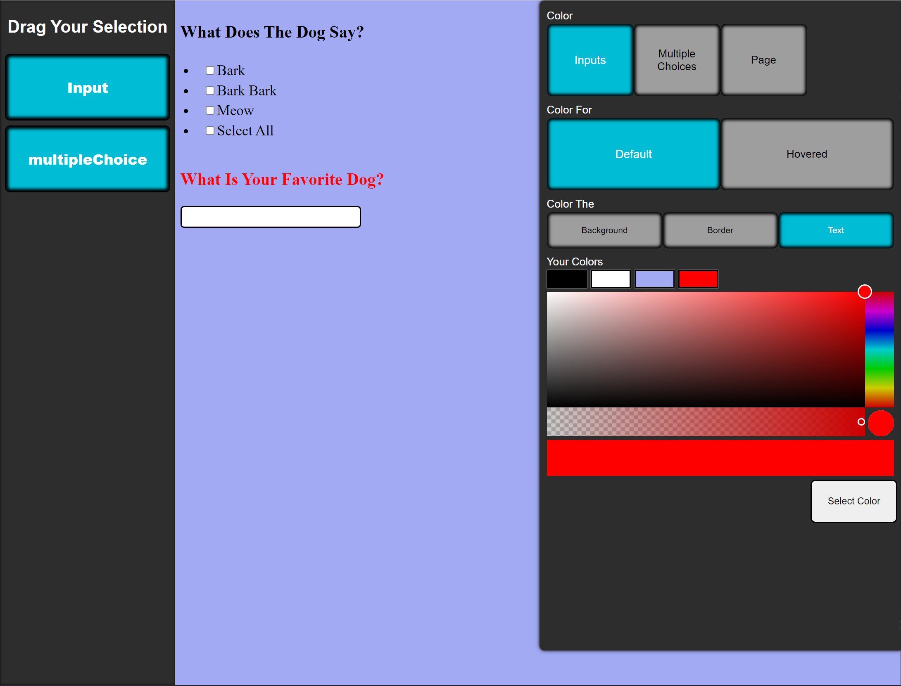

# `Form Designer`

### `Created By: David Couch`
### `Created 7/12/2021`

## `About`
- This application was created to learn Reacts drag and drop props features, advanced functional programming, and advanced shared logic through custom hooks. This is to test these concepts, not to implement every feature through third party services.
- context is used to manage data and styles.
- Javascript CSS is used in context for styles that will change, this way that data can be stored in a no SQL database in the same format.
- Styled Components CSS is used for components that the user does not change.
- Inputs Type - Input Titles - and Multiple Choice Options are stored within Context as Form Data.
- Components are generated after a user submits its values and are read from an array head in local state. A snap shot of that data is held as formData in Context that will be the same data that is used to submit to a noSQL database.
- After a User Creates a form a snapshot can be saved of the title names and types and can then be re rendered using the same process logic as when the form was created ( not implemented ). Because of the way that this application was created this data could be stored in a noSQL database and users would be able to create forms and then share links with people to receive replies on that data.

`Custom Hooks`

- `useAppStyles`
    - This hook is used to reduce styles and seamlessly change them from the same function
- `useInput`
    - This hook is used to generate a component based on the users chosen attributes. This hook also generates the snapshot in context for rendering from a user perspective. It does both using the same process.

`File Structure`

- Components hold all components in the app
    - This is a small application that currently only has a single page. In the future a generated ID could be used to query a database for the form that matches the users creation but for now it there is no need for a pages directory.
- Folder -> index.js - styles.js
    - The folder is created to hold all files that strongly relate and or are dependent to that component.
    - Such as
        - index.js, the root of the component
        - styles.js where the styles components are held
        - options.js (EXAMPLE), additional files that hold objects that will be used within the applications. This was the logic can be viewed quickly and data can be viewed if needed in its own place.

# `Tech Used`

- `react-dnd: "^14.0.2"`
- `react-dnd-html5-backend: "^14.0.0"`
- `styled-components: "^5.3.0"`
- `uuid: "^8.3.2"`
- `lucid-color-picker: "^0.1.0"`

## `Preview`

